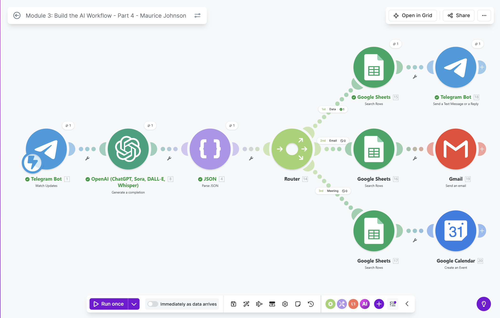
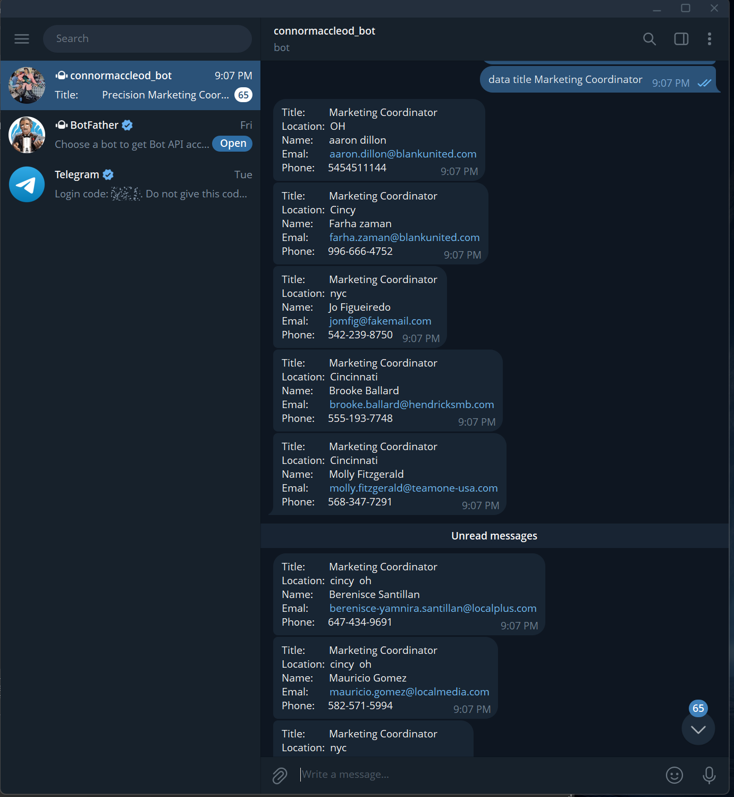

# Module 3: Build the AI Workflow - Novatech - Part 4

## Project Overview
This project is an automated AI-driven workflow built on **Make.com** that serves as an intelligent assistant via **Telegram**. The system watches for incoming messages, uses **OpenAI (GPT-4o-mini)** to classify user intent and extract key entities (names, locations, dates), and then routes the data to perform specific actions—such as searching and retrieving contact information from **Google Sheets**, sending emails, or creating calendar events.

## Workflow Architecture
The automation follows a branched logic flow after an initial analysis phase:

1.  **Trigger: Telegram (Watch Updates)**
    * Monitors a Telegram bot for new user messages.
2.  **AI Analysis: OpenAI (Create Chat Completion)**
    * Uses the `gpt-4o-mini` model to process input.
    * **Role:** Classifies queries into "email", "meeting", "data", or "unknown".
    * **Extraction:** Captures structured data: `person_name`, `person_location`, `person_job`, and `meeting_date`.
3.  **Data Processing: JSON Parser**
    * Converts the AI's string response into usable data objects for the subsequent modules.
4.  **Routing: Basic Router**
    * Directs the workflow into one of three specialized paths based on the AI classification.

### Path 1: Data Inquiry
* **Filter:** Classification is "Data".
* **Action:** Searches a Google Sheet for rows where the job title matches the extracted `person_job`.
* **Output:** Sends a Telegram reply with the person's Title, Location, Name, Email, and Phone.

### Path 2: Email Invitation
* **Filter:** Classification is "Email" AND location is "NYC".
* **Action:** Searches for the contact in Google Sheets and sends a formatted HTML invitation for a Novatech event.

### Path 3: Meeting Scheduling
* **Filter:** Classification is "Meeting".
* **Action:** Verifies the person's status in Google Sheets (e.g., "Interested") and creates a 1-hour event on Google Calendar using the extracted `meeting_date`.

### Visualizing the Workflow
Below is the live execution of the scenario in Make.com, showing the successful routing of a "Data" inquiry:

*As seen in the image, the pulse moves through the Telegram trigger, OpenAI completion, and JSON parsing before the Router directs it to the 'Search Rows' Google Sheets module and back to Telegram.*

### User Experience & Results
The final output is delivered directly to the user within Telegram. The image below demonstrates the bot successfully retrieving and formatting multiple records from the database based on the user's natural language request:

*The bot interprets the command "data title Marketing Coordinator" and returns structured contact details including Title, Location, Name, Email, and Phone for all matching leads.*

## Technology Stack
The following tools and technologies are integrated into this solution:

* **Automation Platform:** [Make.com](https://www.make.com/)
* **AI/LLM:** OpenAI API (`gpt-4o-mini`)
* **Messaging:** Telegram Bot API
* **Productivity:** Google Workspace (Google Sheets, Google Calendar, Gmail)
* **Data Formats:** JSON (JavaScript Object Notation), HTML (for email templates)
* **Logic Tools:** Routers, Complex Filters, and Data Structures

## Configuration & Setup
To import and run this workflow:
1.  **Import:** Upload the provided JSON blueprint to a new Make.com scenario.
2.  **Telegram:** Connect your Bot Token.
3.  **OpenAI:** Add your API Key.
4.  **Google Sheets:** Map the Spreadsheet  and ensure columns A-CZ are accessible.
5.  **Data Structure:** Configure the JSON parser to use the UDT (User Defined Type) with keys: `classification`, `person_name`, `person_location`, `person_job`, and `meeting_date`.
